<a href="https://ashforde.org">
<picture>
  <source media="(prefers-color-scheme: dark)" srcset="assets/hero-dark.svg">
  
</picture>
</a>

## Start here

If you are evaluating us, these three tell you the most, fastest:

- **[yanaops.com](https://yanaops.com)** — the open mission-operations standard. **Pre-release**: read it, implement it, hold us to it.
- **[kshana.dev](https://kshana.dev)** — a validated PNT simulator you can run yourself and check our arithmetic.
- **[ashforde.org](https://ashforde.org)** — the company in one page: premise, domains, approach, standing.

**[→ Explore the figures interactively](https://ashforde.org/githubprofile/)** — hover any day, filter by language, sort the projects. The cards below are static images; that page is not.

<a href="https://ashforde.org/#domains">
<picture>
  <source media="(prefers-color-scheme: dark)" srcset="assets/domains-dark.svg">
  
</picture>
</a>

## Open engineering

Most of what we build is confidential. These are the pieces we publish, because a
standard nobody can inspect is not a standard.

<a href="https://yanaops.com">
<picture>
  <source media="(prefers-color-scheme: dark)" srcset="assets/project-yana-dark.svg">
  
</picture>
</a>

> **YANA·Ops is pre-release.** Nothing is published to npm, PyPI or crates, and no
> version is tagged. **7** operations are marketed and **17** are cross-validated against an
> independent implementation, on a path to 50 and then 150. When it ships it ships with the
> conformance suite, not before. Read the standard now at **[yanaops.com](https://yanaops.com)**.

<a href="https://kshana.dev">
<picture>
  <source media="(prefers-color-scheme: dark)" srcset="assets/project-kshana-dark.svg">
  
</picture>
</a>

<a href="https://ashfordeou.github.io/grasp">
<picture>
  <source media="(prefers-color-scheme: dark)" srcset="assets/project-grasp-dark.svg">
  
</picture>
</a>

## Working languages

Measured across all **51** repositories, private included. Private repositories are
counted, never named. Each badge links to that language's home.

<a href="https://www.python.org" title="Python — 33.1% of 384.4 MB across 51 repositories"><picture><source media="(prefers-color-scheme: dark)" srcset="assets/lang-python-dark.svg"></picture></a>
<a href="https://www.typescriptlang.org" title="TypeScript — 23.0% of 384.4 MB across 51 repositories"><picture><source media="(prefers-color-scheme: dark)" srcset="assets/lang-typescript-dark.svg"></picture></a>
<a href="https://developer.mozilla.org/en-US/docs/Web/HTML" title="HTML — 18.1% of 384.4 MB across 51 repositories"><picture><source media="(prefers-color-scheme: dark)" srcset="assets/lang-html-dark.svg"></picture></a>
<a href="https://developer.mozilla.org/en-US/docs/Web/JavaScript" title="JavaScript — 17.5% of 384.4 MB across 51 repositories"><picture><source media="(prefers-color-scheme: dark)" srcset="assets/lang-javascript-dark.svg"></picture></a>
<a href="https://www.rust-lang.org" title="Rust — 2.4% of 384.4 MB across 51 repositories"><picture><source media="(prefers-color-scheme: dark)" srcset="assets/lang-rust-dark.svg"></picture></a>
<a href="https://www.swift.org" title="Swift — 2.1% of 384.4 MB across 51 repositories"><picture><source media="(prefers-color-scheme: dark)" srcset="assets/lang-swift-dark.svg"></picture></a>
<a href="https://kotlinlang.org" title="Kotlin — 1.2% of 384.4 MB across 51 repositories"><picture><source media="(prefers-color-scheme: dark)" srcset="assets/lang-kotlin-dark.svg"></picture></a>
<a href="https://developer.hashicorp.com/terraform/language" title="HCL — 0.6% of 384.4 MB across 51 repositories"><picture><source media="(prefers-color-scheme: dark)" srcset="assets/lang-hcl-dark.svg"></picture></a>
<a href="https://www.latex-project.org" title="TeX — 0.6% of 384.4 MB across 51 repositories"><picture><source media="(prefers-color-scheme: dark)" srcset="assets/lang-tex-dark.svg"></picture></a>

<a href="#working-languages">
<picture>
  <source media="(prefers-color-scheme: dark)" srcset="assets/stack-dark.svg">
  
</picture>
</a>

## Activity

<a href="https://github.com/ashfordeOU">
<picture>
  <source media="(prefers-color-scheme: dark)" srcset="assets/activity-dark.svg">
  
</picture>
</a>

<picture>
  <source media="(prefers-color-scheme: dark)" srcset="assets/standing-dark.svg">
  
</picture>

## Research

<a href="https://arxiv.org/a/baweja_c_1">
<picture>
  <source media="(prefers-color-scheme: dark)" srcset="assets/research-dark.svg">
  
</picture>
</a>

Discovered by author query, so a new preprint appears here without anyone editing this file.

Read the preprints

- [**2607.06212**](https://arxiv.org/abs/2607.06212) — The Cost of Lunar South-Polar Geometry, and Surface Beacons as the Efficient Fix — *astro-ph.EP*, 7 Jul 2026
- [**2607.02566**](https://arxiv.org/abs/2607.02566) — Earth-baseline VLBI restores the observability of a lunar surface station in joint orbit-and-clock determination — *eess.SP*, 29 Jun 2026
- [**2606.24210**](https://arxiv.org/abs/2606.24210) — A Conditional Timing Protection Level: Holdover-Limited Undetected Time Error Under GNSS Spoofing — *eess.SP*, 23 Jun 2026
- [**2607.05415**](https://arxiv.org/abs/2607.05415) — How Stable Is a PNT Resilience Score? Decision-Instability of Single-Number Composites — *cs.CR*, 22 Jun 2026
- [**2606.22054**](https://arxiv.org/abs/2606.22054) — Anticipating the Optimism Gap: Predicting Distribution-Shift Degradation of RF-Impairment Detectors — *eess.SP*, 20 Jun 2026

<a href="https://ashforde.org/#approach">
<picture>
  <source media="(prefers-color-scheme: dark)" srcset="assets/commitments-dark.svg">
  
</picture>
</a>

## What we are doing now

- **Publishing the operations standard** — taking YANA·Ops from pre-release to a first tagged release, conformance suite included.
- **Extending validated coverage** — cross-validation from 17 operations toward 50, each differenced against an independent implementation.
- **Writing the methods down** — preprints first, so results can be reproduced and contested before they are relied on.
- **Talking to operators** — conversations with the people who fly spacecraft, and the institutions that must answer for the decisions.

## Conversations held in confidence

**[contact@ashforde.org](mailto:contact@ashforde.org)** · [ashforde.org](https://ashforde.org) · [LinkedIn](https://www.linkedin.com/company/ashfordeou/) · [arXiv](https://arxiv.org/a/baweja_c_1)

Company facts

| | |
|---|---|
| Legal entity | Ashforde OÜ |
| Registry code | 17321180, Estonian Commercial Register |
| Registered office | Ahtri tn 12, 15551 Tallinn, Estonia |
| Operating base | Frankfurt, Germany |
| Founder and director | Chakshu Baweja |
| Languages | English · Français · Deutsch · Italiano · Español · Eesti · Nederlands |
| Trademark | ASHFORDE™ — Ashforde OÜ |

How this page stays current

Every figure is measured, not typed. A scheduled workflow regenerates the whole page daily:

| Source | What it feeds |
|---|---|
| GitHub GraphQL | contribution calendar, public/private split, streak, peak day |
| GitHub REST | repository count, language mass across **all** repositories, releases |
| arXiv API | preprints, discovered by author query — new papers appear unprompted |

A GitHub README runs no JavaScript, so the cards above are images with links and tooltips.
The genuinely interactive version lives at
**[ashforde.org/githubprofile](https://ashforde.org/githubprofile/)**.

